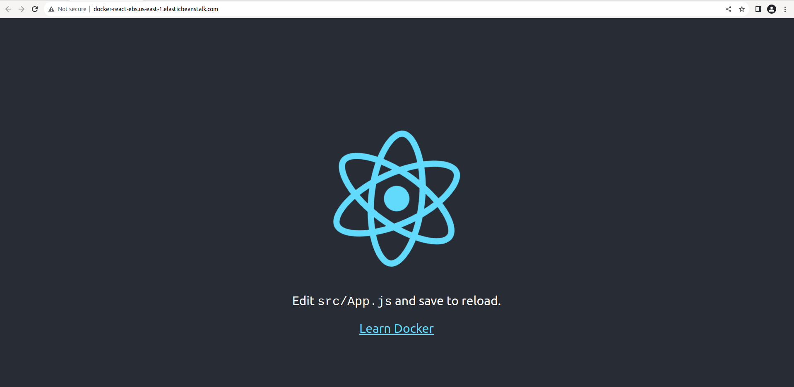

# Using Travis-CI to deploy react-app to AWS Elastic Beanstalk

## Tools used:
- Terraform to build your infrastructure
- Docker and Docker-Compose
- CI/CD tool "Travis-CI"
- AWS Elastic Beanstalk

## First we need to prepare our infrastructure
```bash
$ aws configure --profile tf-user
AWS ACCESS KEY ID [None]: <YOUR AK>
AWS Secret Access Key [None]: <YOUR SK>
Default region name [None]: <In my case I used us-east-1>
Default output formate [None]: json

$ cd infrastructure
$ terraform init
$ terraform apply --auto-approve

```
### 'Some Notes'
- I used multi-stage Containers in the production Dockerfile to follow the best practices in building Dockerfile.
- Exposing Port must be to Port 80 because we use NGINX in the running stage.
- AWS ElasticBeanstalk creates S3 bucket to pull the code from there
- AWS ElasticBeanstalk look to the root path, it builds and runs the docker-compose file there so take care about name it with the default name or maybe you will face in deployment stage like I faced :D
- Elastic Beanstalk handles the port mapping from the container to the hosting machine.
- AK/SK must be added to TravisCI environment variables because Travis-ci.yml is using them in accessing the s3 bucket and elastic beanstalk. 
### Now you've built your infrastructure,Next step is pushing to GitHub repository in my I case I used Travis-CI to automate the build/test/deploy stages after any change happens on my GitHub repository, Please look at .travis-CI.yml file for more info.

### Last step you should visit the DNS that EBS gives you:


